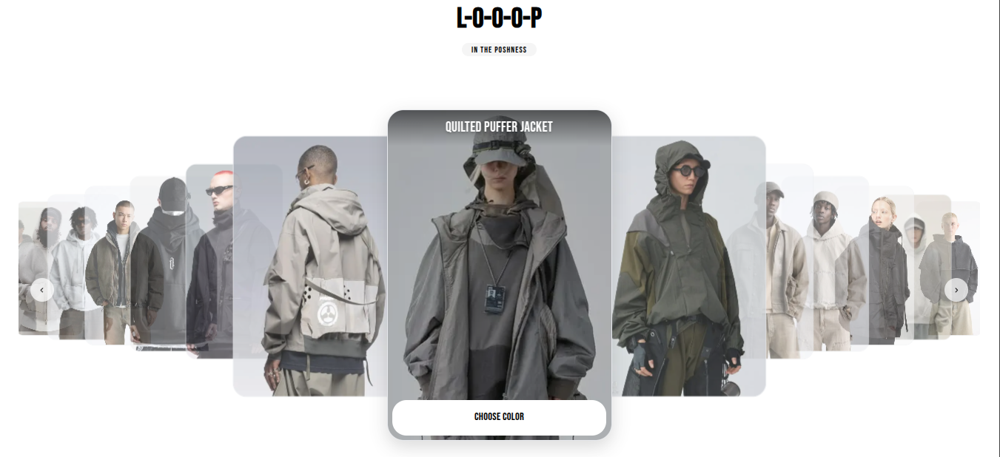

# LOOOP - Modern Carousel

[](https://nextjs.org/)
[](https://www.typescriptlang.org/)
[](https://tailwindcss.com/)
[](https://swiperjs.com/)
[](LICENSE)
[](https://looop-co.vercel.app)

A modern, interactive product carousel implementation built with Next.js, featuring a rich coverflow effect for showcasing items.



## Features

- ⚡ Built with Next.js 15
- 🎭 Interactive Coverflow Carousel using Swiper.js
- 🖼️ Responsive product cards with beautiful transitions
- 🎨 Custom styling with Tailwind CSS and custom CSS
- 📱 Fully responsive design for all device sizes
- 🔤 Custom typography with Bebas Neue font
- ✨ Type Safety with TypeScript
- 🖌️ Optimized images using Next.js Image component

## Live Demo

🌐 [View the Live Demo](https://looop-co.vercel.app)

## Getting Started

1. Clone the repository:
   ```bash
   git clone https://github.com/solaimanb/looop.git
   ```

2. Install dependencies:
   ```bash
   npm install
   ```

3. Start the development server:
   ```bash
   npm run dev
   ```

4. Open [http://localhost:3000](http://localhost:3000) in your browser to see the result.

## Project Structure

```
├── src/
│   ├── app/
│   │   ├── (marketing)/        # Marketing pages including home page
│   │   ├── globals.css         # Global styles
│   │   └── layout.tsx          # Root layout with font configuration
│   ├── components/
│   │   ├── hero/               # Hero section components
│   │   │   ├── SwiperCarousel.tsx  # Main carousel component
│   │   │   ├── Hero.tsx           # Hero wrapper component
│   │   │   └── carousel.css       # Custom carousel styles
└── public/                     # Static assets
```

## Carousel Implementation

The product carousel features:

- **Modern Coverflow Effect**: Displays products with a 3D-like effect where the center item is prominent
- **Dynamic Sizing**: Active slides are larger than adjacent slides, which are larger than outer slides
- **Smooth Transitions**: CSS transitions handle the size and opacity changes
- **Interactive Navigation**: Custom next/previous buttons and pagination
- **Responsive Design**: Adapts to different screen sizes with custom breakpoints

## Customization

### Adding More Products

Edit the `products` array in `src/components/hero/SwiperCarousel.tsx` to add or modify products:

```typescript
const products: Product[] = [
  {
    id: "16",
    name: "Your New Product",
    description: "Product description here",
    price: "$199.99",
    image: "https://example.com/your-image.jpg",
    buttonText: "Shop Now",
    buttonLink: "/shop/your-product",
  },
  // More products...
];
```

### Styling

Customize the carousel appearance in `src/components/hero/carousel.css`.

## Performance Considerations

- Images are optimized using Next.js Image component
- CSS transitions are hardware-accelerated
- Swiper.js is configured for optimal performance

## Contributing

1. Fork the repository
2. Create your feature branch (`git checkout -b feature/amazing-feature`)
3. Commit your changes (`git commit -m 'Add some amazing feature'`)
4. Push to the branch (`git push origin feature/amazing-feature`)
5. Open a Pull Request

## License

This project is licensed under the MIT License - see the LICENSE file for details.

## Acknowledgements

- Jacket images sourced from Pinterest
- Built with [Swiper.js](https://swiperjs.com/)
- Font by [Google Fonts](https://fonts.google.com/)

## Author

Created by [S010](https://github.com/solaimanb)

<a href="https://www.buymeacoffee.com/solaimanb" target="_blank">
  
</a>